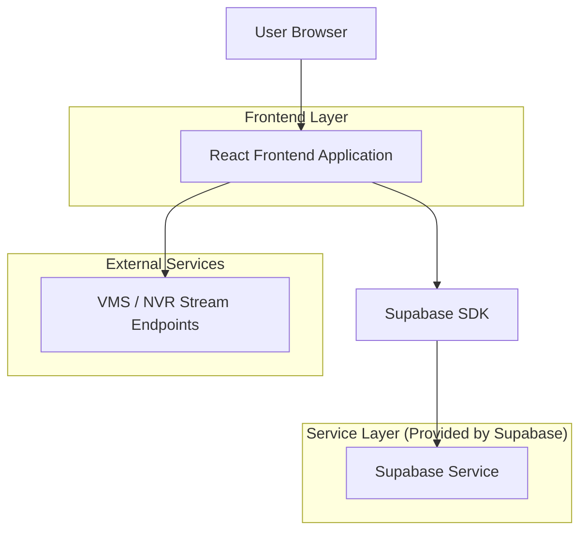
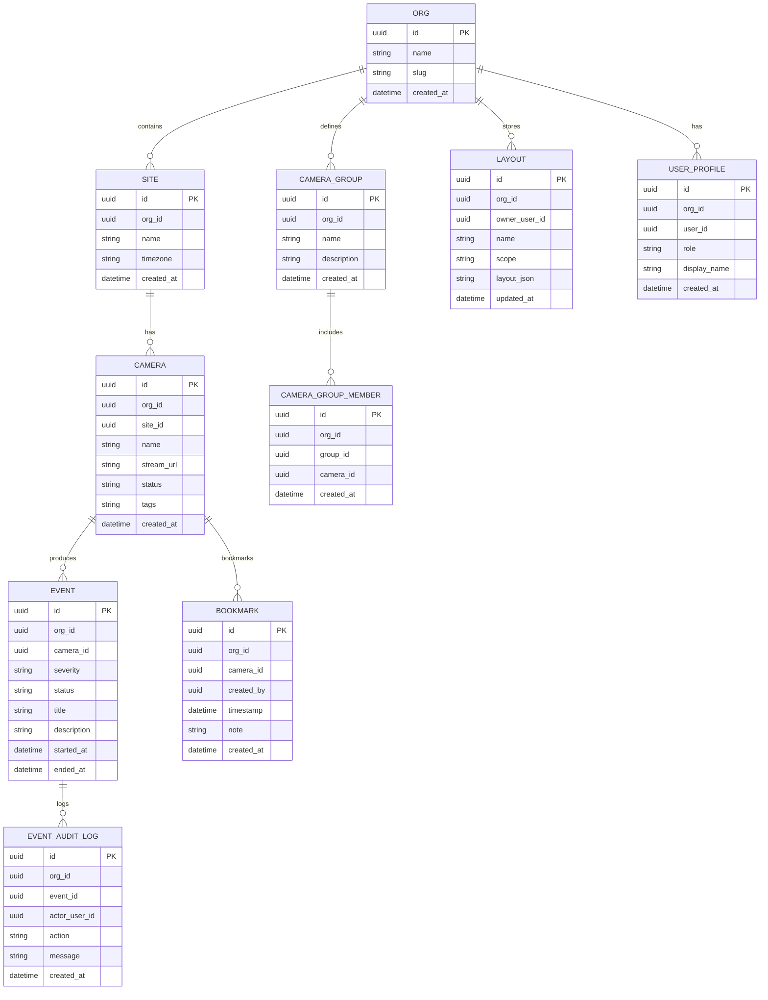

## 1.Architecture design



Notas de arquitetura (essenciais):
- O dashboard web consome streams a partir de endpoints já publicados pelo seu VMS/NVR (ex.: HLS/WebRTC), mantendo o produto focado em UI/controle operacional.
- Autenticação, dados de configuração (câmeras, grupos, permissões), eventos e auditoria ficam no Supabase.

## 2.Technology Description
- Frontend: React@18 + TypeScript + vite + tailwindcss@3
- Backend: Supabase (Auth + PostgreSQL + Storage)
- External (necessário para vídeo): Endpoints de streaming do VMS/NVR (HLS/WebRTC) e/ou gateway existente do seu ambiente

## 3.Route definitions
| Route | Purpose |
|-------|---------|
| /login | Login e recuperação de acesso |
| / | Dashboard (visão geral), KPIs e atalhos |
| /monitoramento | Ao vivo + playback + layouts + bookmarks |
| /eventos | Lista e tratativa de eventos/alarmes |
| /admin | Gestão de câmeras, grupos, usuários e preferências |

## 6.Data model(if applicable)

### 6.1 Data model definition


### 6.2 Data Definition Language
User Profile (user_profile)
```sql
CREATE TABLE user_profile (
  id UUID PRIMARY KEY DEFAULT gen_random_uuid(),
  org_id UUID NOT NULL,
  user_id UUID NOT NULL,
  role VARCHAR(20) NOT NULL CHECK (role IN ('operador','supervisor','admin')),
  display_name VARCHAR(120),
  created_at TIMESTAMPTZ NOT NULL DEFAULT now()
);

GRANT SELECT ON user_profile TO anon;
GRANT ALL PRIVILEGES ON user_profile TO authenticated;
```

Organizações (org)
```sql
CREATE TABLE org (
  id UUID PRIMARY KEY DEFAULT gen_random_uuid(),
  name VARCHAR(160) NOT NULL,
  slug VARCHAR(80) UNIQUE NOT NULL,
  created_at TIMESTAMPTZ NOT NULL DEFAULT now()
);

GRANT SELECT ON org TO anon;
GRANT ALL PRIVILEGES ON org TO authenticated;
```

Locais/Unidades (site)
```sql
CREATE TABLE site (
  id UUID PRIMARY KEY DEFAULT gen_random_uuid(),
  org_id UUID NOT NULL,
  name VARCHAR(160) NOT NULL,
  timezone VARCHAR(60) NOT NULL DEFAULT 'America/Sao_Paulo',
  created_at TIMESTAMPTZ NOT NULL DEFAULT now()
);

CREATE INDEX idx_site_org_id ON site(org_id);

GRANT SELECT ON site TO anon;
GRANT ALL PRIVILEGES ON site TO authenticated;
```

Câmeras (camera)
```sql
CREATE TABLE camera (
  id UUID PRIMARY KEY DEFAULT gen_random_uuid(),
  org_id UUID NOT NULL,
  site_id UUID,
  name VARCHAR(160) NOT NULL,
  stream_url TEXT NOT NULL,
  status VARCHAR(20) NOT NULL DEFAULT 'unknown' CHECK (status IN ('online','offline','degraded','unknown')),
  tags TEXT,
  created_at TIMESTAMPTZ NOT NULL DEFAULT now()
);

CREATE INDEX idx_camera_org_id ON camera(org_id);
CREATE INDEX idx_camera_site_id ON camera(site_id);

GRANT SELECT ON camera TO anon;
GRANT ALL PRIVILEGES ON camera TO authenticated;
```

Grupos (camera_group) e membros (camera_group_member)
```sql
CREATE TABLE camera_group (
  id UUID PRIMARY KEY DEFAULT gen_random_uuid(),
  org_id UUID NOT NULL,
  name VARCHAR(160) NOT NULL,
  description TEXT,
  created_at TIMESTAMPTZ NOT NULL DEFAULT now()
);

CREATE TABLE camera_group_member (
  id UUID PRIMARY KEY DEFAULT gen_random_uuid(),
  org_id UUID NOT NULL,
  group_id UUID NOT NULL,
  camera_id UUID NOT NULL,
  created_at TIMESTAMPTZ NOT NULL DEFAULT now()
);

CREATE INDEX idx_cgm_org_group ON camera_group_member(org_id, group_id);
CREATE INDEX idx_cgm_camera_id ON camera_group_member(camera_id);

GRANT SELECT ON camera_group TO anon;
GRANT SELECT ON camera_group_member TO anon;
GRANT ALL PRIVILEGES ON camera_group TO authenticated;
GRANT ALL PRIVILEGES ON camera_group_member TO authenticated;
```

Eventos (event) e auditoria (event_audit_log)
```sql
CREATE TABLE event (
  id UUID PRIMARY KEY DEFAULT gen_random_uuid(),
  org_id UUID NOT NULL,
  camera_id UUID NOT NULL,
  severity VARCHAR(10) NOT NULL CHECK (severity IN ('low','med','high','crit')),
  status VARCHAR(20) NOT NULL DEFAULT 'open' CHECK (status IN ('open','ack','closed')),
  title VARCHAR(200) NOT NULL,
  description TEXT,
  started_at TIMESTAMPTZ NOT NULL DEFAULT now(),
  ended_at TIMESTAMPTZ
);

CREATE TABLE event_audit_log (
  id UUID PRIMARY KEY DEFAULT gen_random_uuid(),
  org_id UUID NOT NULL,
  event_id UUID NOT NULL,
  actor_user_id UUID,
  action VARCHAR(40) NOT NULL,
  message TEXT,
  created_at TIMESTAMPTZ NOT NULL DEFAULT now()
);

CREATE INDEX idx_event_org_status ON event(org_id, status);
CREATE INDEX idx_event_camera_id ON event(camera_id);
CREATE INDEX idx_event_audit_event_id ON event_audit_log(event_id);

GRANT SELECT ON event TO anon;
GRANT SELECT ON event_audit_log TO anon;
GRANT ALL PRIVILEGES ON event TO authenticated;
GRANT ALL PRIVILEGES ON event_audit_log TO authenticated;
```

Bookmarks (bookmark) e Layouts (layout)
```sql
CREATE TABLE bookmark (
  id UUID PRIMARY KEY DEFAULT gen_random_uuid(),
  org_id UUID NOT NULL,
  camera_id UUID NOT NULL,
  created_by UUID,
  timestamp TIMESTAMPTZ NOT NULL,
  note TEXT,
  created_at TIMESTAMPTZ NOT NULL DEFAULT now()
);

CREATE TABLE layout (
  id UUID PRIMARY KEY DEFAULT gen_random_uuid(),
  org_id UUID NOT NULL,
  owner_user_id UUID,
  name VARCHAR(160) NOT NULL,
  scope VARCHAR(20) NOT NULL DEFAULT 'private' CHECK (scope IN ('private','shared')),
  layout_json JSONB NOT NULL,
  updated_at TIMESTAMPTZ NOT NULL DEFAULT now()
);

CREATE INDEX idx_bookmark_org_camera ON bookmark(org_id, camera_id);
CREATE INDEX idx_layout_org_owner ON layout(org_id, owner_user_id);

GRANT SELECT ON bookmark TO anon;
GRANT SELECT ON layout TO anon;
GRANT ALL PRIVILEGES ON bookmark TO authenticated;
GRANT ALL PRIVILEGES ON layout TO authenticated;
```