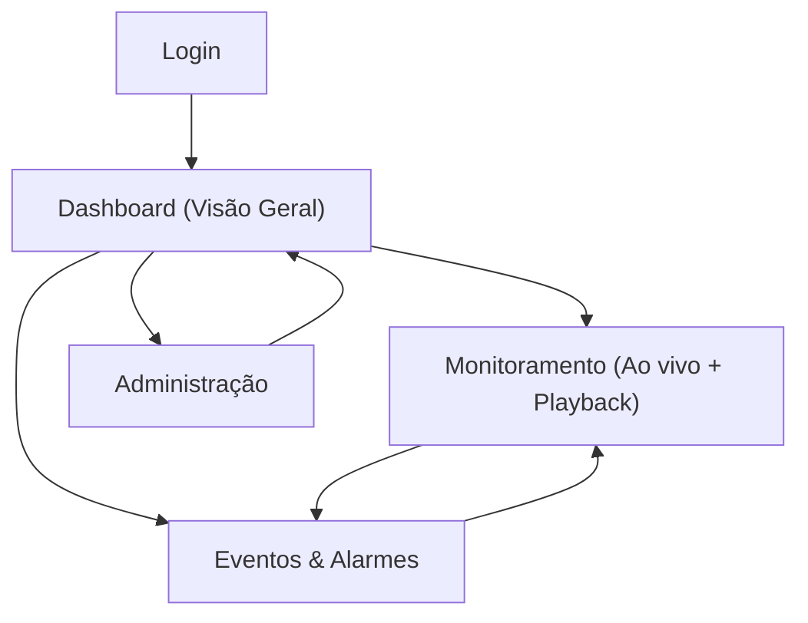

## 1. Product Overview
Dashboard web estilo VMS (pegada Digifort) para monitoramento de câmeras, investigação (playback) e gestão de eventos/alertas em uma interface moderna e intuitiva.
Focado em operação rápida (NOC/Segurança) com navegação clara, layouts de monitoramento e trilhas de auditoria.

## 2. Core Features

### 2.1 User Roles
| Papel | Método de cadastro | Permissões principais |
|------|---------------------|-----------------------|
| Operador | Criado por Administrador (convite/link) | Visualizar câmeras/layouts permitidos, usar playback conforme permissão, reconhecer/fechar eventos, criar bookmarks |
| Supervisor | Criado por Administrador | Tudo do Operador + gerenciar layouts compartilhados, revisar e reabrir eventos, exportar evidências (se habilitado) |
| Administrador | Criado por Administrador (primeiro admin) | Gerenciar usuários, permissões, unidades/locais, cadastro de câmeras, integrações e regras de eventos |

### 2.2 Feature Module
O dashboard VMS web consiste nas seguintes páginas principais:
1. **Login**: autenticação e seleção de organização/unidade (se aplicável).
2. **Dashboard (Visão Geral)**: resumo operacional, status do sistema, acesso rápido a layouts, eventos recentes.
3. **Monitoramento (Ao vivo + Playback)**: mosaico de câmeras, controles de visualização, linha do tempo para investigação.
4. **Eventos & Alarmes**: fila de eventos, filtros, reconhecimento/encerramento e trilha de auditoria.
5. **Administração**: gestão de câmeras, grupos, usuários/permissões e preferências globais.

### 2.3 Page Details
| Page Name | Module Name | Feature description |
|-----------|-------------|---------------------|
| Login | Autenticação | Entrar com e-mail/senha via provedor; manter sessão; sair da conta |
| Login | Recuperação de acesso | Solicitar redefinição de senha (via e-mail) |
| Dashboard (Visão Geral) | Navegação principal | Acessar Monitoramento, Eventos e Administração conforme permissões |
| Dashboard (Visão Geral) | KPIs operacionais | Exibir contadores essenciais (câmeras online/offline, eventos abertos, eventos críticos) |
| Dashboard (Visão Geral) | Status do sistema | Mostrar saúde de conectividade/latência dos streams (por câmera) e avisos de degradação |
| Dashboard (Visão Geral) | Acesso rápido | Abrir layouts favoritos/recentes; retomar última sessão de monitoramento |
| Monitoramento (Ao vivo + Playback) | Mosaico de câmeras | Exibir grid configurável; trocar câmera por busca/drag-and-drop; alternar qualidade (quando disponível) |
| Monitoramento (Ao vivo + Playback) | Controles de câmera | Dar play/pause (live), mute/unmute, fullscreen, snapshot (se permitido) |
| Monitoramento (Ao vivo + Playback) | Playback / Investigação | Selecionar câmera e intervalo; navegar por timeline; pular por eventos; ajustar velocidade |
| Monitoramento (Ao vivo + Playback) | Layouts | Salvar/editar layouts pessoais; abrir layouts compartilhados (se permitido) |
| Monitoramento (Ao vivo + Playback) | Bookmarks | Criar marcador com anotação e timestamp; listar e abrir marcador |
| Eventos & Alarmes | Fila de eventos | Listar eventos em tempo real; destacar severidade; abrir detalhe do evento |
| Eventos & Alarmes | Filtros e busca | Filtrar por severidade, status, câmera, período e palavra-chave |
| Eventos & Alarmes | Tratativa | Reconhecer, comentar e encerrar evento; registrar responsável e timestamps |
| Eventos & Alarmes | Auditoria do evento | Exibir histórico de mudanças (status, comentários, responsável) |
| Administração | Cadastro de câmeras | Criar/editar/desativar câmera; definir nome, local, grupo e endpoint/stream URL |
| Administração | Grupos e acesso | Criar grupos (por local/setor); atribuir câmeras a grupos; definir quem pode ver o quê |
| Administração | Usuários e permissões | Criar/editar usuários; atribuir papel; configurar permissões por grupo/câmera |
| Administração | Preferências globais | Definir padrões (grid default, time zone, retenção/limites de bookmark/export se aplicável) |

## 3. Core Process

### Fluxo do Operador/Supervisor
1. Você faz login.
2. Você cai no Dashboard e verifica: câmeras offline e eventos críticos.
3. Você abre um layout favorito no Monitoramento para ver o ao vivo.
4. Ao identificar uma ocorrência, você alterna para Playback, escolhe período e investiga pela linha do tempo.
5. Se houver evento, você abre a tela de Eventos, reconhece, comenta e encerra (conforme permissão).
6. Quando necessário, você cria um bookmark para facilitar retomada e auditoria.

### Fluxo do Administrador
1. Você faz login e acessa Administração.
2. Você cadastra/organiza câmeras por local/grupo.
3. Você cria usuários, define papéis e concede acesso por grupo/câmera.
4. Você ajusta preferências globais e revisa status geral.

